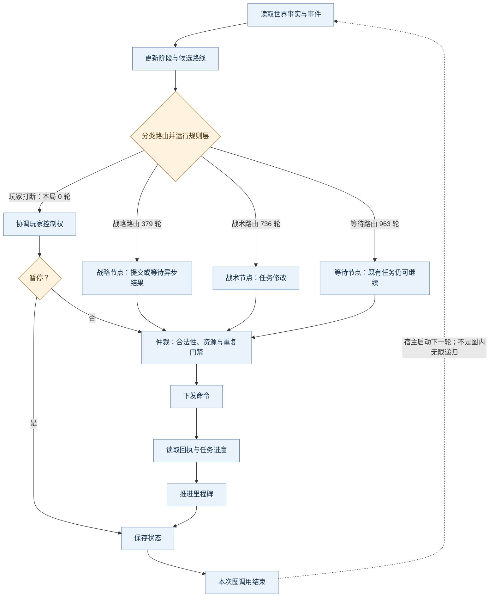

# 现有程序循环

源码拓扑；分支计数来自本局 event_classified，表示路由次数，不是模型调用次数。宿主下一轮是外部循环。节点没有 enter/exit 日志时，不据此声称精确节点耗时。

```mermaid
flowchart TD
    ingest["读取世界事实与事件"] --> campaign["更新阶段与候选路线"]
    campaign --> classify{"分类路由并运行规则层"}
    classify -->|"战略路由 379 轮"| strategy["战略节点：提交或等待异步结果"]
    classify -->|"战术路由 736 轮"| tactics["战术节点：任务修改"]
    classify -->|"等待路由 963 轮"| wait["等待节点：既有任务仍可继续"]
    classify -->|"玩家打断：本局 0 轮"| reconcile["协调玩家控制权"]
    reconcile --> paused{"暂停？"}
    paused -->|"是"| checkpoint["保存状态"]
    paused -->|"否"| arbitrate["仲裁：合法性、资源与重复门禁"]
    strategy --> arbitrate
    tactics --> arbitrate
    wait --> arbitrate
    arbitrate --> dispatch["下发命令"]
    dispatch --> receipt["读取回执与任务进度"]
    receipt --> advance["推进里程碑"]
    advance --> checkpoint
    checkpoint --> host["本次图调用结束"]
    host -. "宿主启动下一轮；不是图内无限递归" .-> ingest
    classDef normal fill:#eaf2fb,stroke:#617e9e,color:#17334c;
    classDef branch fill:#fff2de,stroke:#b98a48,color:#513a16;
    class ingest,campaign,strategy,tactics,wait,reconcile,arbitrate,dispatch,receipt,advance,checkpoint,host normal;
    class classify,paused branch;
```
