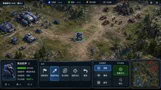

# 策划文档_UI交互说明

> 状态：待评审  
> 本文定义当前 RTS Demo 的战场 HUD、普通单位操作 HUD、AI 副官 HUD 以及两者之间的切换规则。  
> 前置规则：《策划文档_基础交互逻辑文档》。

---

## 1. UI 总体结构

游戏始终保持 RTS 战场主视图。

当前战场存在两套主要 HUD：

1. **普通 RTS HUD**
2. **AI 副官 HUD**

两套 HUD 使用同一个实时战场，不切换场景，不改变镜头。

默认进入：

**普通 RTS HUD**

按 `Tab`：

**普通 RTS HUD ↔ AI 副官 HUD**

---

## 2. 普通 RTS HUD

普通 RTS HUD 用于玩家直接操作战场单位。

当前程序已有的 RTS HUD 结构继续保留，包括：

- 小地图；
- 单位选择；
- 单位信息；
- 单位菜单；
- 单位命令；
- 生产相关界面；
- 当前已经存在的其他 RTS 战场信息。

当前版本首先定义普通战斗单位。

建筑、英雄、特殊单位以及特殊技能根据实际需求后续单独补充。



---

## 3. 普通战斗单位信息

选择普通战斗单位后显示：

- 单位名称；
- 生命值等基础状态；
- 当前命令；
- 当前交战姿态；
- 当前开火状态。

表现示意：

```text
突击战车
生命值：820 / 820
当前命令：移动并攻击
交战姿态：侵略
开火状态：自由开火
```

---

## 4. 普通单位命令

当前程序已经存在的普通单位命令按钮继续保留。

| 操作 | 结果 |
|---|---|
| 强制移动 | 指定目标位置后进行强制移动 |
| 移动并攻击 | 向指定目标推进并攻击途中敌人 |
| 停止移动 | 停止当前移动相关行为 |
| 强制攻击 | 明确攻击指定单位或地面 |
| 撤退 | 指定撤退位置 |

这些按钮已经存在于当前普通单位命令 HUD 中，因此当前版本继续保留。

新增快捷键不要求重复增加新的 UI 按钮。

---

## 5. 目标型操作

以下操作需要指定目标：

- 强制移动；
- 移动并攻击；
- 强制攻击；
- 撤退。

统一流程：

**点击按钮 / 按快捷键 → 进入目标选择 → 战场指定目标 → 执行命令**

进入目标选择后显示对应提示。

例如：

**强制移动：请选择目标位置**

取消目标选择后，不执行该命令。

当前程序已有这一套目标选择和反馈流程。

---

## 6. 交战姿态

普通战斗单位直接使用当前程序已有三种交战姿态：

| 姿态 | 行为 |
|---|---|
| **侵略** | 主动索敌并追击 |
| **警戒** | 围绕岗位迎击，结束后返回岗位 |
| **固守** | 不主动移动，只攻击进入射程的敌人 |

当前程序已经存在侵略、警戒、固守三个按钮。

当前生效的交战姿态保持高亮。

交战姿态是单位持续状态，不是独立的单位 AI 模式。

---

## 7. 开火状态

当前程序已有：

- 自由开火；
- 停火。

普通单位 HUD 继续保留现有的 **停火 / 恢复开火** 操作。

**自由开火**：单位按照当前交战姿态自主攻击。

**停火**：单位停止自主开火。

交战姿态和开火状态相互独立。

---

## 8. 普通 RTS HUD 快捷操作

普通单位可以同时通过 UI 按钮、鼠标和快捷键执行相同的底层功能。

| 输入 | 功能 |
|---|---|
| `R` | 攻击移动 |
| `F` | 停止 |
| `G` | 原地防守 |
| `C` | 强制移动 |
| `X` | 强制攻击 |
| `Z` | 战术撤退 |

快捷键存在不代表必须增加对应的新按钮。

当前已经存在的按钮继续保留。

---

## 9. AI 副官 HUD

按 `Tab`：

**从普通 RTS HUD 切换到 AI 副官 HUD。**

AI 副官 HUD 不改变实时战场。

进入后，AI 相关信息成为主要操作界面。

AI 副官 HUD 当前包含：

- AI 副官状态；
- 当前任务与战场上下文；
- 当前控制对象 / 编队信息；
- AI 对话记录；
- AI 最近执行的操作；
- AI 执行结果；
- 快捷询问；
- 文字输入；
- 语音输入状态。

当前程序已有 AI 副官原型界面，现有 AI 状态、上下文、对话记录、快捷询问和文字输入能力继续复用。


---

## 10. AI 副官快捷询问

当前已有：

- 下一步？
- 风险？
- 战况？

继续保留。

这些按钮属于 AI 快捷询问，不属于单位战斗命令。

---

## 11. AI 文字输入

AI 副官 HUD 中保留当前文字输入框。

按 `Enter`：

**聚焦 AI 文字输入。**

玩家可以直接输入自然语言，包括但不限于：

- “1队向左推进。”
- “现在风险最大的区域在哪里？”
- “让前面的部队固守。”
- “先不要开火。”
- “现在下一步应该做什么？”

AI 返回理解结果、执行结果、战场分析或需要玩家确认的信息。

---

## 12. AI 语音输入

按住 `V`：

**开始 AI 语音输入。**

松开：

**提交语音内容。**

AI 副官 HUD 显示当前语音状态。

语音和文字使用同一套 AI 指令理解和执行规则。

---

## 13. AI 执行反馈

AI 执行战场操作后显示：

- 作用对象；
- 执行内容；
- 执行状态。

表现示意：

```text
1队 → 固守 → 已执行
2队 → 战术撤退 → 执行中
目标不明确 → 等待玩家确认
```

AI 执行失败时显示原因。

---

## 14. Tab 切换规则

`Tab` 专门负责两个 HUD 之间的切换。

当前处于普通 RTS HUD 时按 `Tab`：

**打开 AI 副官 HUD。**

当前处于 AI 副官 HUD 时再次按 `Tab`：

**返回普通 RTS HUD。**

切换 HUD 不会改变：

- 当前单位选择；
- 当前命令；
- 交战姿态；
- 开火状态；
- 镜头位置。

---

## 15. 两个 HUD 的关系

普通 RTS HUD：

**玩家直接操作单位。**

AI 副官 HUD：

**玩家通过 AI 进行战场交流、分析和下达战术意图。**

两套 HUD 控制的是同一个实时战场。

单位的自主战斗行为直接由交战姿态和开火策略表达，不设置独立的单位 AI 操作层。

---

## 16. 两个 HUD 的显示重点

### 普通 RTS HUD

主要突出：

- 当前选择单位；
- 单位命令；
- 交战姿态；
- 开火状态；
- 小地图；
- 普通 RTS 战场操作。

AI 副官仅保留必要的轻量状态提示。

### AI 副官 HUD

主要突出：

- AI 对话；
- 当前任务；
- 战场上下文；
- AI 分析；
- 编队信息；
- 最近执行结果；
- 文字 / 语音输入。

普通单位命令区域可以在 AI 副官 HUD 中缩小、弱化或收起。

---

## 17. 镜头

两种 HUD 下镜头控制完全一致：

| 输入 | 功能 |
|---|---|
| `WASD` | 镜头移动 |
| `Q / E` | 镜头旋转 |
| 鼠标滚轮 | 镜头缩放 |
| `Space` | 跳转到最近重要战场事件 |

切换 HUD 不影响镜头。

---

## 18. 数字编队

数字编队规则：

- `1–9`：选择编队；
- `Ctrl + 1–9`：保存 / 覆盖编队；
- `Shift + 1–9`：追加单位；
- 双击数字：选择编队并定位镜头。

普通 RTS HUD 和 AI 副官 HUD 共用同一套数字编队。

AI 副官可以直接引用数字编队，例如：

**“1队撤退。”**

---

## 19. 当前版本扩展顺序

当前版本先完成普通战斗单位 UI 和 AI 副官 HUD。

英雄技能、特殊单位技能、特殊兵种专属操作、建筑专属高级操作在对应功能进入 Demo 时再单独补充。

当前程序已经存在的 UI 不因本规则删除。

---

## 20. 当前 UI 核心规则

1. 战场始终保持可见。
2. 默认使用普通 RTS HUD。
3. `Tab` 在普通 RTS HUD 与 AI 副官 HUD 之间切换。
4. 单位自主行为由命令、交战姿态和开火状态表达。
5. 当前程序已经存在的普通单位按钮继续保留。
6. 新增快捷键不强制增加新按钮。
7. AI 副官使用独立 HUD。
8. AI 副官 HUD 复用当前已有 AI 界面能力继续发展。
9. 两个 HUD 操作同一个实时战场。
10. 两个 HUD 切换不改变单位状态和镜头状态。
